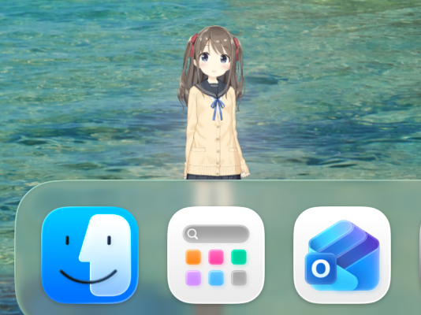
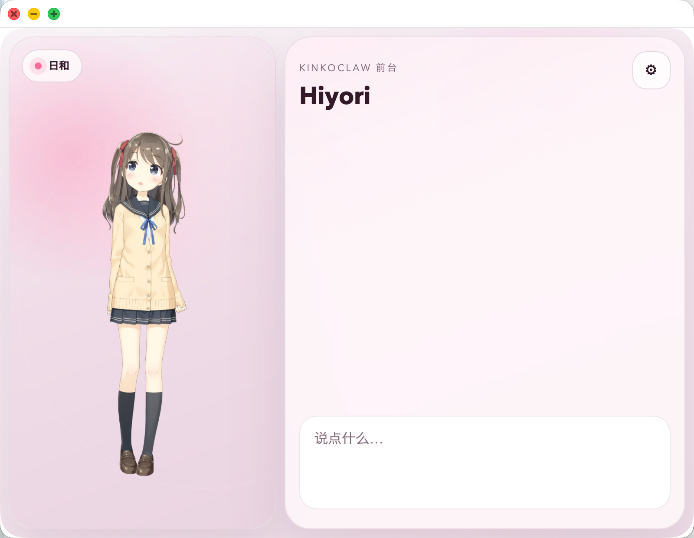
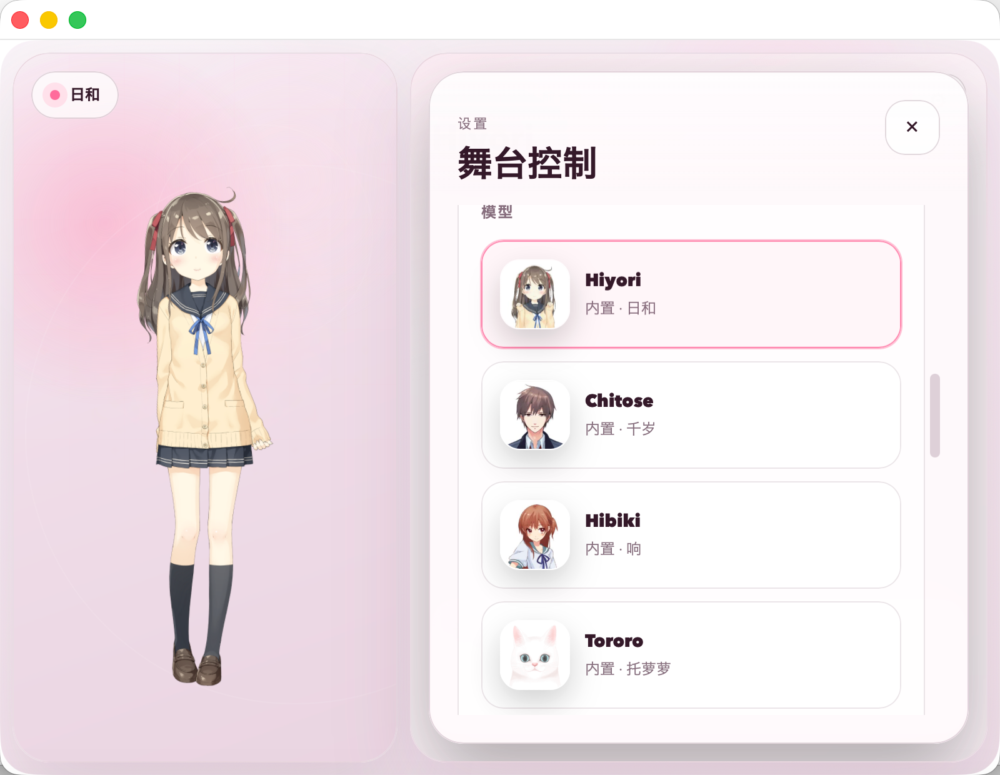

# KinkoClaw

[简体中文](README.zh-CN.md)

> KinkoClaw is the macOS desktop shell for OpenClaw Gateway.

KinkoClaw turns an existing OpenClaw Gateway into a native macOS experience with a menu bar companion, a floating desktop pet, and a Live2D chat stage.


## Product Snapshot

### Desktop Pet



### Main Stage



### Model Picker



## Core Capabilities

- Menu bar companion that stays out of the Dock during normal use
- Floating desktop pet that opens the main stage on click
- Live2D stage with a character view on the left and chat on the right
- Local, SSH tunnel, and direct `wss://` gateway connection modes
- Character switching with built-in and imported Live2D models
- Scene framing controls for scale and offsets
- Local persona memory card that shapes replies before sending
- Light and dark appearance modes inside the stage

## Product Shape

KinkoClaw is intentionally a thin macOS client.

- It does not host the model backend
- It does not replace your existing OpenClaw Gateway deployment
- It focuses on desktop interaction, character presentation, and chat UX

This makes it useful when you already run OpenClaw locally or on a remote machine and want a dedicated desktop shell instead of a browser-first control surface.

## Quick Start

1. Make sure you already have an OpenClaw Gateway running.
2. Launch KinkoClaw.
3. Open the stage or settings drawer.
4. Connect with one of the supported modes:
   - Local `ws://127.0.0.1`
   - SSH tunnel
   - Direct `wss://`
5. Pick a Live2D model and start chatting through the `main` session.

## Run From Source

### Requirements

- macOS 15+
- Xcode
- Node.js
- pnpm

### Daily Development

```bash
./scripts/run-kinkoclaw-debug.sh
```

This is the default local workflow. It rebuilds the stage runtime, rebuilds the Swift target, stops old instances, and launches the visible debug binary directly.

## Package the App

When you want a distributable `.app` bundle:

```bash
./scripts/package-kinkoclaw-app.sh
```

## Repository Layout

- `apps/macos/Sources/KinkoClaw` — native macOS shell
- `apps/macos/stage-live2d` — Live2D stage frontend runtime
- `apps/macos/Tests/KinkoClawTests` — focused client tests
- `scripts/run-kinkoclaw-debug.sh` — visible debug-binary launcher
- `scripts/package-kinkoclaw-app.sh` — final macOS app packaging
- `assets/readme/` — README screenshots

## License

MIT
